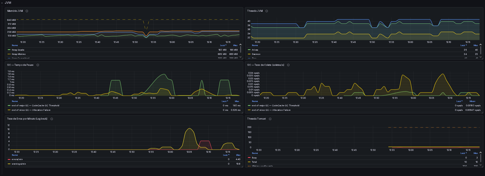
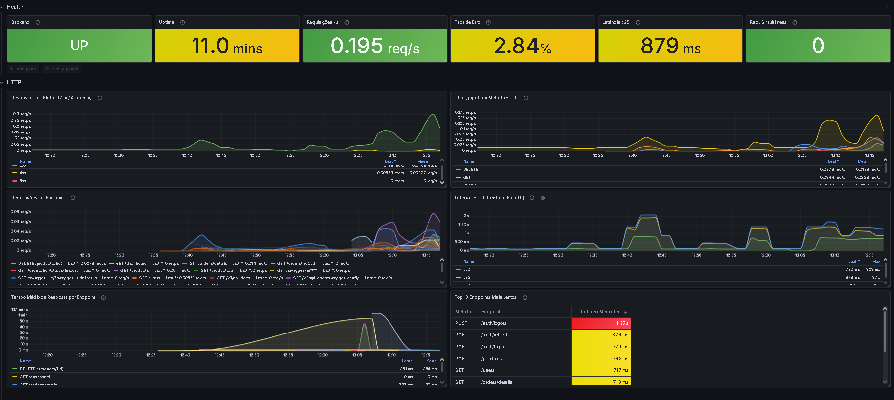
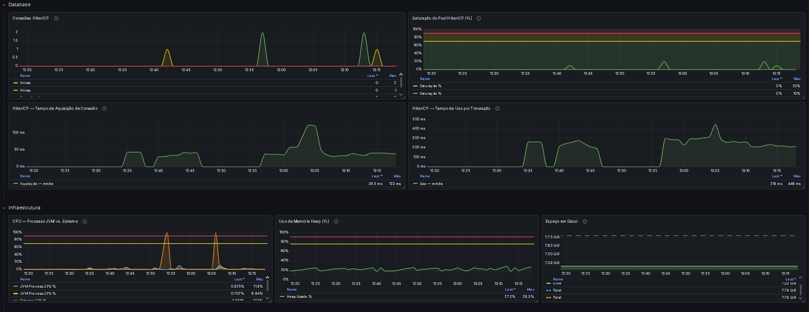
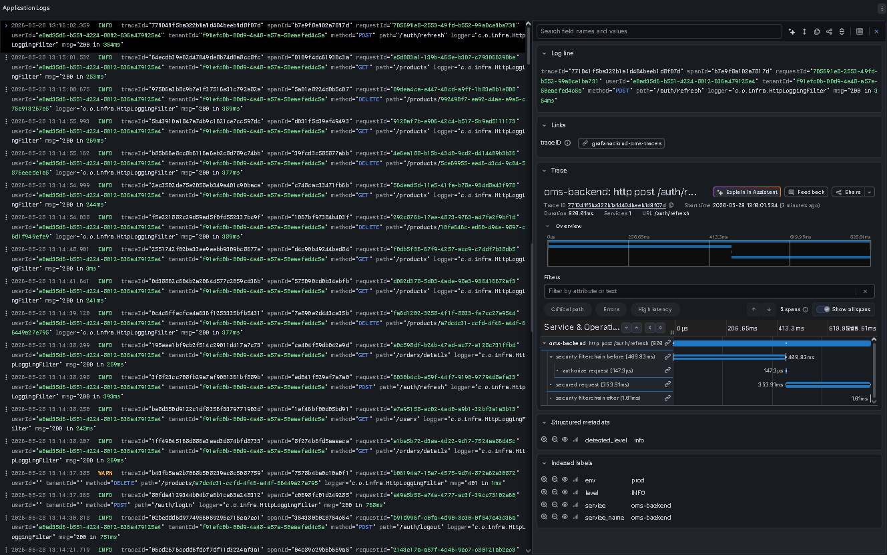

# Order Management System (OMS) — Backend

[](https://github.com/WiltonReis/order-system-backend/actions/workflows/backend.yml)


Esse é o backend de um sistema de gestão de pedidos que montei como projeto de portfólio. A ideia foi fugir do CRUD básico e construir algo mais perto do que se vê numa empresa de verdade: uma API multi-tenant onde cada empresa cadastrada tem os dados totalmente isolados, com login por JWT, observabilidade rodando em produção e deploy automatizado.

Não é um produto real e nem tem a pretensão de ser. É onde eu pratico decisões de arquitetura, segurança e observabilidade com calma, e mostro como penso essas coisas. Boa parte do tempo aqui foi gasta nas partes que normalmente ficam escondidas: isolamento de dados entre empresas, o que monitorar em produção e como manter tudo isso rodando de graça.

**Frontend do projeto:** [github.com/WiltonReis/order-system-frontend](https://github.com/WiltonReis/order-system-frontend)

| | Link |
|---|---|
| App (produção) | [tanstack-start-app.wiltonfilho0825.workers.dev](https://tanstack-start-app.wiltonfilho0825.workers.dev) |
| Swagger UI | [/swagger-ui/index.html](https://order-system-backend-noble-fog-4603.fly.dev/swagger-ui/index.html) |

> **Sobre o link de produção:** manter uma instância sempre no ar custa dinheiro, e isso não faz muito sentido pra um projeto de portfólio. Então o app pode estar fora do ar quando você acessar. Pra ver funcionando, o caminho mais garantido é rodar localmente com Docker (instruções mais abaixo).

---

## Sumário

- [Funcionalidades](#funcionalidades)
- [Stack utilizada](#stack-utilizada)
- [Arquitetura do projeto](#arquitetura-do-projeto)
- [Observabilidade](#observabilidade)
- [Segurança](#segurança)
- [Como rodar localmente](#como-rodar-localmente)
- [Variáveis de ambiente](#variáveis-de-ambiente)
- [API](#api)
- [Prints e gifs](#prints-e-gifs)
- [O que eu mudaria num cenário real de produção/SaaS](#o-que-eu-mudaria-num-cenário-real-de-produçãosaas)
- [Autor](#autor)
- [Licença](#licença)

---

## Funcionalidades

- **Cadastro de empresa.** A empresa se registra com CNPJ ou CPF e já sai com o primeiro usuário ADMIN criado.
- **Login com JWT.** O token vai num cookie `httpOnly`, com refresh token de 30 dias. O logout limpa os dois.
- **Isolamento por empresa.** Cada empresa só enxerga os próprios dados. Isso é aplicado no nível do Hibernate, então não dá pra esquecer um `WHERE` e vazar dado de outro tenant.
- **Pedidos.** Criação de pedido completo (itens e desconto numa transação só), mudança de status e exclusão com janela de "desfazer" de 1 minuto.
- **Histórico de status.** Toda mudança de status fica registrada com quem fez e quando.
- **Exportação em PDF.** Cada pedido pode ser baixado como PDF com itens, desconto, totais e dados de auditoria.
- **Produtos.** CRUD completo, com upload de imagem indo pro Cloudflare R2.
- **Usuários.** Gestão dos membros da empresa (só ADMIN). E-mail e nome podem ser reaproveitados depois que um usuário é removido.
- **Dashboard.** Números agregados por empresa: pedidos por status, receita e filtros por período.
- **Rate limiting.** As rotas de login, registro e refresh têm limite de requisições pra travar tentativa de força bruta.
- **Paginação e filtros.** Todas as listagens aceitam página, tamanho e filtros.

---

## Stack utilizada

**Base**
- Java 21 e Spring Boot 3.2.5
- Spring Data JPA + Hibernate (ORM e multi-tenancy)
- PostgreSQL 16
- Flyway para migrations versionadas

**Segurança**
- Spring Security
- JJWT para gerar e validar os tokens
- Bucket4j (com Caffeine) para o rate limiting
- caelum-stella para validar CPF e CNPJ

**Observabilidade**
- Micrometer (Prometheus em dev, OTLP push em produção)
- Micrometer Tracing com bridge pro OpenTelemetry
- loki4j para mandar os logs pro Loki
- Logstash Logback Encoder para logs em JSON

**Documentação e PDF**
- springdoc-openapi (Swagger UI)
- OpenPDF para gerar os PDFs de pedido

**Testes e infra**
- Testcontainers (sobe um PostgreSQL real nos testes de integração)
- AWS SDK v2 para falar com o Cloudflare R2
- Lombok

---

## Arquitetura do projeto

A API é um monólito organizado em camadas. Controller só recebe e devolve HTTP, a regra de negócio fica nos services e o acesso ao banco nos repositories. Escolhi monólito de propósito: é um projeto solo, e quebrar em microsserviços só traria infra pra cuidar sem ganho nenhum.

```
┌──────────────────────────────────────────────┐
│           Cliente (Frontend / HTTP)          │
└──────────────────┬───────────────────────────┘
                   │ HTTPS + cookie httpOnly
┌──────────────────▼───────────────────────────┐
│              Spring Boot API                 │
│                                              │
│  RateLimitFilter → JwtAuthenticationFilter   │
│            → MdcFilter (traceId)             │
│                                              │
│  Controllers   (só HTTP, trabalham com DTOs) │
│  Services      (regra de negócio)            │
│  Repositories  (Spring Data JPA, sem N+1)    │
│            + Hibernate @Filter (tenant)      │
└──────────────────┬───────────────────────────┘
                   │ JDBC / migrations Flyway
┌──────────────────▼───────────────────────────┐
│        PostgreSQL 16 (Supabase / local)      │
└──────────────────────────────────────────────┘
```

### Organização dos pacotes

```
src/main/java/com/ordersystem/
├── config/       # SecurityConfig, ActuatorSecurityConfig, properties
├── controller/   # camada HTTP, sem lógica de negócio
├── dto/          # request (com validação) e response (nunca expõe a entidade)
├── entity/       # entidades JPA, soft-delete e filtro de tenant
├── enums/        # OrderStatus, Role
├── exception/    # erros padronizados (RFC 7807) no GlobalExceptionHandler
├── infra/        # filtros de MDC, rate limit e logging
├── repository/   # Spring Data JPA + queries nativas pro soft-delete
├── security/     # JwtTokenProvider, filtro de auth, TenantContext
├── service/      # regra de negócio + geração de PDF
└── validation/   # @CpfCnpj e validadores de domínio
```

### Multi-tenancy

Cada empresa é um tenant, e todas dividem o mesmo banco e o mesmo schema. O que separa os dados é uma coluna `customer_saas_id` em cada tabela. O fluxo é assim:

1. No registro, nasce uma empresa (`CustomerSaas`) junto com o primeiro usuário ADMIN.
2. O JWT carrega o `tenantId` como claim.
3. A cada request, o filtro de autenticação valida esse claim e guarda o tenant num `ThreadLocal`.
4. Um `@Filter` do Hibernate injeta o `WHERE customer_saas_id = :tenantId` em toda query, automaticamente.
5. O `@SQLRestriction` ainda esconde os registros que foram soft-deletados.

A parte mais importante disso é confiável de verdade, então tem teste de integração pra provar: ele sobe dois tenants num PostgreSQL real e confirma que um nunca consegue ler dado do outro, nem mesmo registros excluídos.

### Infraestrutura em produção

| Parte | Onde roda | Detalhes |
|---|---|---|
| Backend | [Fly.io](https://fly.io) | Docker, região de São Paulo (`gru`), 512 MB de RAM, com auto-stop |
| Banco | [Supabase](https://supabase.com) | PostgreSQL 16 gerenciado |
| Imagens | [Cloudflare R2](https://cloudflare.com/r2) | fotos dos produtos |
| Frontend | [Cloudflare Workers](https://workers.cloudflare.com) | TanStack Start (SSR no edge) |
| Observabilidade | [Grafana Cloud](https://grafana.com/products/cloud/) | métricas, logs e traces, tudo no free tier |

---

## Observabilidade

Essa foi a parte que eu mais quis explorar. A API exporta as três coisas que importam pra entender o que está acontecendo em produção: métricas, logs e traces. O código que gera tudo isso é o mesmo nos dois ambientes; o que muda é só pra onde os dados vão, controlado por variáveis de ambiente.

### Dev e produção funcionam diferente (e tem um motivo)

Em desenvolvimento o Prometheus faz scrape: ele bate no `/actuator/prometheus` a cada 15 segundos e puxa as métricas. Funciona bem porque tudo está rodando junto no Docker.

Em produção isso quebra. A VM no Fly.io tem auto-stop, então ela dorme quando não tem tráfego. Acordar a máquina a cada 15 segundos só pra um scrape ia contra a ideia de custo zero. A solução foi inverter: em vez do Prometheus puxar, o próprio backend empurra as métricas pro Grafana Cloud via OTLP. Logs e traces seguem o mesmo padrão de push.

```
DEV
  Micrometer → /actuator/prometheus ← Prometheus (scrape 15s) → Grafana
  loki4j → Loki local
  OpenTelemetry → Tempo local

PROD
  Micrometer OTLP → Grafana Cloud Mimir   (push, 60s)
  loki4j          → Grafana Cloud Loki    (push)
  OpenTelemetry   → Grafana Cloud Tempo   (push, 10% de sampling)
```

### Logs

Os logs saem em JSON pelo loki4j, um appender do Logback que manda os dados direto pro Loki, sem precisar de sidecar. Em dev o destino é o Loki do Docker; em produção, o Grafana Cloud Loki.

Cada log carrega os campos que ajudam a rastrear uma requisição: `traceId`, `spanId`, `userId`, `tenantId`, método e rota HTTP. Senhas e tokens são mascarados antes de sair. As labels são poucas e de baixa cardinalidade (`service`, `env`, `level`), o resto fica no corpo e dá pra filtrar via LogQL:

```logql
{service="oms-backend", env="prod"} | json | tenantId = "abc123"
```

### Traces

O tracing usa Micrometer Tracing com o bridge do OpenTelemetry. Toda requisição ganha um `traceId` que entra em todos os logs daquela request. Isso liga log e trace nos dois sentidos: dá pra clicar num `traceId` no log e cair direto no trace dentro do Tempo, ou ir de um pico de latência no dashboard até a requisição que causou.

### O que o dashboard mostra

O dashboard de produção acompanha o básico de saúde da JVM e da API:

- **JVM e GC:** uso de heap, frequência de coleta e tempo de pausa.
- **HTTP:** requisições por segundo, latência (p50/p95/p99) e taxa de erro 5xx.
- **Banco:** conexões ativas do HikariCP e tempo pra pegar uma conexão do pool.
- **Processo:** CPU, threads do Tomcat e uptime.









### Quanto custa

Nada. Toda a observabilidade de produção cabe no free tier do Grafana Cloud com folga:

| Componente | Free tier | Uso real |
|---|---|---|
| Mimir (métricas) | 10k séries | bem abaixo disso |
| Loki (logs) | 50 GB / 14 dias | menos de 100 MB/mês |
| Tempo (traces) | 50 GB / 14 dias | poucos MB/mês com sampling de 10% |

---

## Segurança

| Item | Como funciona |
|---|---|
| Access token | JWT de 10 minutos, com o `tenantId` validado em cada request |
| Refresh token | 30 dias, em cookie `httpOnly`, renova o par de tokens |
| Cookie `Secure` | obrigatório em produção; a aplicação nem sobe se vier desligado em prod |
| Autorização | `@PreAuthorize` por role em todas as rotas protegidas |
| Rate limiting | 10 req/min no login e registro, 5 req/min no refresh |
| CPF/CNPJ | validação com o algoritmo oficial (caelum-stella) |
| Erros | resposta padronizada em `application/problem+json` com `requestId` e erros por campo |
| CORS | origens liberadas vêm de variável de ambiente |
| Métricas | o `/actuator/prometheus` fica atrás de Basic Auth com um usuário dedicado |

Um detalhe que eu gostei de resolver: o endpoint de métricas tem uma cadeia de segurança própria, separada da API. Assim o Basic Auth das métricas e o JWT da aplicação não se misturam e não dá pra um interferir no outro.

---

## Como rodar localmente

### Opção 1 — Docker Compose (a mais fácil)

Sobe tudo de uma vez: Postgres, pgAdmin, backend, Prometheus, Grafana, Loki e Tempo.

```bash
git clone https://github.com/WiltonReis/order-system-backend.git
cd order-system-backend

cp .env.example .env   # ajuste o que quiser

make up                # ou: docker compose up -d
```

Depois que subir:

| Serviço | URL |
|---|---|
| API | `http://localhost:8080` |
| Swagger UI | `http://localhost:8080/swagger-ui/index.html` |
| Health check | `http://localhost:8080/actuator/health` |
| pgAdmin | `http://localhost:5050` |
| Prometheus | `http://localhost:9090` |
| Grafana | `http://localhost:3001` |
| Loki | `http://localhost:3100` |
| Tempo | `http://localhost:3200` |

O Grafana já sobe com os datasources e os dashboards configurados, sem passo manual.

Comandos do `make`:

| Comando | O que faz |
|---|---|
| `make up` | sobe tudo em background |
| `make down` | para e remove os containers |
| `make logs` | acompanha os logs de todos os serviços |
| `make dev` | sobe só Postgres + pgAdmin (pra rodar o backend pelo `mvn`) |

### Opção 2 — Rodar o backend direto (Java + Postgres)

Precisa de Java 21, Maven 3.9+ e PostgreSQL 16.

```bash
make dev   # sobe só o banco

export DB_USERNAME=postgres
export DB_PASSWORD=postgres
export JWT_SECRET=$(openssl rand -base64 32)
export COOKIE_SECURE=false
export APP_CORS_ALLOWED_ORIGINS=http://localhost:3000
export METRICS_USERNAME=grafana_scraper
export METRICS_PASSWORD=changeme

mvn spring-boot:run -Dspring-boot.run.profiles=dev
```

O Flyway aplica as migrations sozinho na primeira vez. Nesse modo o Loki não sobe, então os logs aparecem só no console (colorido).

### Testes

```bash
mvn verify
```

Os testes cobrem três camadas:

**Unitários (service):** lógica de negócio com Mockito. Cobrem criação e ciclo de vida de pedidos, geração de PDF, tokens de refresh, blacklist de JTI, rate limiter e dashboard.

**Camada web (`@WebMvcTest`):** testes de slice, sem banco. Verificam status HTTP, Bean Validation e autorização `@PreAuthorize` por role — rápidos e focados no contrato HTTP.

**Integração (Testcontainers):** sobe um PostgreSQL 16 de verdade, aplica as migrations e roda contra o banco real. Destaques:

- `TenantIsolationIntegrationTest` — dois tenants ativos ao mesmo tempo; confirma que um nunca lê dado do outro, nem registros excluídos.
- `AuthorizationIntegrationTest` — cada operação ADMIN-only exercitada com role `USER` (→ 403) e com `ADMIN` (→ sucesso).
- `TokenSecurityIntegrationTest` — token expirado e assinatura adulterada → 401; refresh com JTI revogado → rejeitado.
- `RateLimitIntegrationTest` — esgota o bucket de `/auth/login` e confirma o 429.
- `OrderQueryPerformanceTest` — via Hibernate Statistics, garante que `/orders/details` executa ≤ 3 queries independente do volume de dados.

---

## Variáveis de ambiente

### Aplicação

| Variável | Pra que serve | Obrigatória em prod |
|---|---|---|
| `DB_USERNAME` | usuário do PostgreSQL | Sim |
| `DB_PASSWORD` | senha do PostgreSQL | Sim |
| `JWT_SECRET` | chave do JWT em Base64 (mín. 32 bytes) | Sim |
| `COOKIE_SECURE` | `true` pra HTTPS | Sim |
| `APP_CORS_ALLOWED_ORIGINS` | origens liberadas | Sim |
| `R2_ENDPOINT` | endpoint do Cloudflare R2 | Só se usar upload |
| `R2_ACCESS_KEY` | access key do R2 | Só se usar upload |
| `R2_SECRET_KEY` | secret key do R2 | Só se usar upload |
| `R2_BUCKET` | nome do bucket | Só se usar upload |

### Observabilidade

| Variável | Pra que serve | Padrão (dev) |
|---|---|---|
| `METRICS_USERNAME` | Basic Auth do `/actuator/prometheus` | `grafana_scraper` |
| `METRICS_PASSWORD` | senha do Basic Auth | `changeme` |
| `LOKI_URL` | endpoint de push do Loki | `http://loki:3100/loki/api/v1/push` |
| `LOKI_USER` | usuário do Loki (Grafana Cloud) | vazio |
| `LOKI_PASSWORD` | senha/token do Loki | vazio |
| `OTLP_METRICS_URL` | endpoint OTLP do Mimir | só prod |
| `OTLP_METRICS_AUTH_BASE64` | token do Mimir em Base64 | só prod |
| `OTLP_TRACING_ENDPOINT` | endpoint OTLP do Tempo | `http://localhost:4318/v1/traces` |
| `OTLP_TRACES_AUTH_BASE64` | token do Tempo em Base64 | só prod |
| `TRACING_SAMPLING_PROBABILITY` | fração de traces amostrados | `1.0` em dev, `0.1` em prod |

### Docker Compose (dev)

| Variável | Pra que serve |
|---|---|
| `PGADMIN_EMAIL` | login do pgAdmin |
| `PGADMIN_PASSWORD` | senha do pgAdmin |
| `GF_ADMIN_USER` | usuário admin do Grafana |
| `GF_ADMIN_PASSWORD` | senha admin do Grafana |

Pra gerar um `JWT_SECRET` seguro: `openssl rand -base64 32`.

---

## API

A documentação completa fica no Swagger, que é a fonte da verdade dos endpoints. Acesse em `/swagger-ui/index.html` em qualquer instância rodando, ou [na produção](https://order-system-backend-noble-fog-4603.fly.dev/swagger-ui/index.html).

Tirando `/auth/**` e `/actuator/health`, tudo exige autenticação (cookie `oms.token` ou header `Authorization: Bearer <token>`). Um gostinho de como é:

| Método | Rota | O que faz |
|---|---|---|
| `POST` | `/auth/register` | registra a empresa e o primeiro ADMIN |
| `POST` | `/auth/login` | autentica e devolve o cookie do token |
| `POST` | `/orders/full` | cria um pedido completo (itens + desconto numa transação) |
| `GET` | `/orders/{id}/pdf` | baixa o pedido em PDF |
| `GET` | `/dashboard` | números agregados da empresa |

Exemplo de corpo do `POST /orders/full`:

```json
{
  "customerName": "Maria Silva",
  "items": [
    { "productId": "a1b2c3d4-...", "quantity": 2 }
  ],
  "discount": 5.00
}
```

---

## Prints e gifs

**Swagger UI**


**Exportação de pedido em PDF**


**Teste de isolamento entre empresas**


---

## O que eu mudaria num cenário real de produção/SaaS

Esse projeto é um portfólio, não um produto de verdade. Por isso muita coisa foi decidida mirando simplicidade, custo zero e velocidade pra entregar, o que pro escopo dele foi a escolha certa. Mas se isso fosse virar um SaaS real, com mais clientes, mais gente no time e exigências maiores de segurança, algumas coisas eu faria diferente. Não é consertar erro; é mostrar que sei onde cada atalho vale a pena e onde ele deixa de valer.

| Hoje | O que eu mudaria | Por quê |
|------|------------------|---------|
| Deploy no Fly.io (simples, região em SP, custo zero com auto-stop) | Migrar pra **AWS ECS** | Encaixa melhor no resto da AWS (RDS, S3, IAM, Secrets Manager), escala de forma mais previsível e roda em plataforma feita pra carga real, sem o app dormir quando não tem tráfego. |
| Autenticação com JWT próprio em cookie `httpOnly` e refresh token | Adotar **OAuth2/OIDC** | Permite login com Google, Microsoft e afins, deixa a identidade num provedor dedicado em vez de espalhar isso pela aplicação, e traz segurança madura de fábrica: rotação de chaves, fluxos padronizados e auditoria de acesso. |
| Monólito (decisão consciente, explicada na seção de arquitetura) | Separar alguns domínios em **microsserviços** (pedidos, identidade, faturamento) | Só faz sentido com escala e vários times: cada um cuida do seu serviço no próprio ritmo, os deploys param de andar juntos e dá pra escalar só o que precisa. |
| Isolamento entre empresas por coluna `customer_saas_id`, aplicada via filtro do Hibernate | Avaliar **um schema por empresa** | O próprio banco passa a garantir o isolamento, o que reduz o risco de uma empresa enxergar dados de outra por causa de um bug. Backup, restore e limites por cliente também ficam mais simples. |
| Empresa se cadastra e já sai com o ADMIN ativo, sem confirmar e-mail | Adicionar **verificação de e-mail** antes de liberar a conta | Barra cadastro falso e fraude, garante um canal de contato real com o cliente e melhora a rastreabilidade de quem usa a plataforma. |
| Sem cobrança | Integrar **pagamento** (Stripe ou parecido) e **assinaturas** | Num SaaS de verdade, monetização não é opcional: planos, cobrança recorrente, inadimplência e limites por plano. Conversa direto com o multi-tenancy, já que cada empresa passa a ter um plano e um ciclo de cobrança. |

---

## Autor

Feito por **Wilton Reis**.

- GitHub: [@WiltonReis](https://github.com/WiltonReis)
- E-mail: wiltonfilho0825@gmail.com
- Linkedin: [Wilton Reis](https://www.linkedin.com/in/wiltonreisaf)

Se quiser trocar uma ideia sobre o projeto ou tem alguma sugestão, pode chamar.

---

## Licença

Esse projeto usa a licença MIT.
