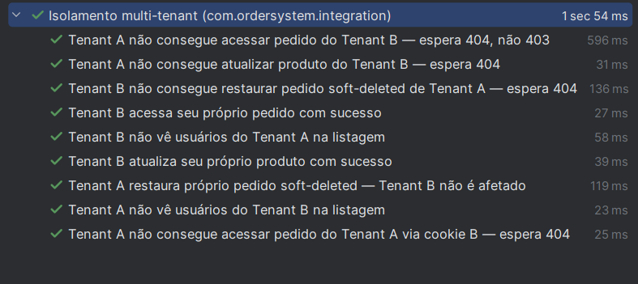
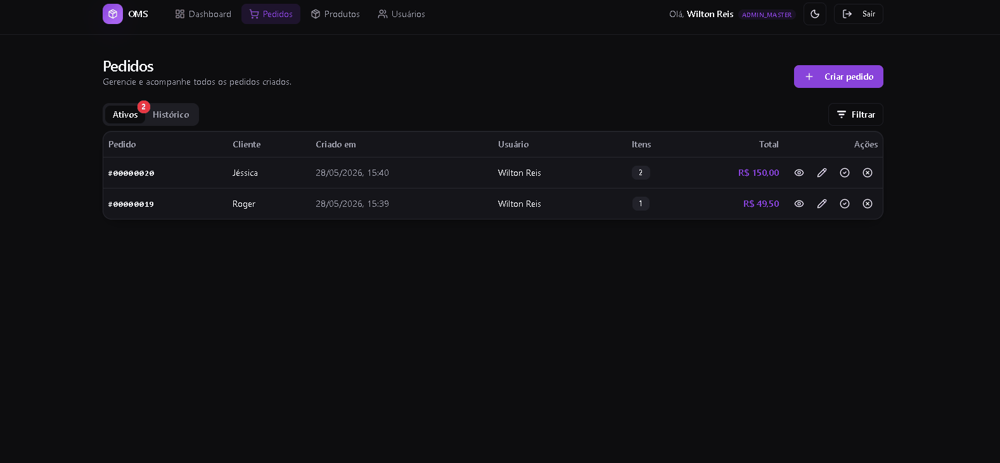
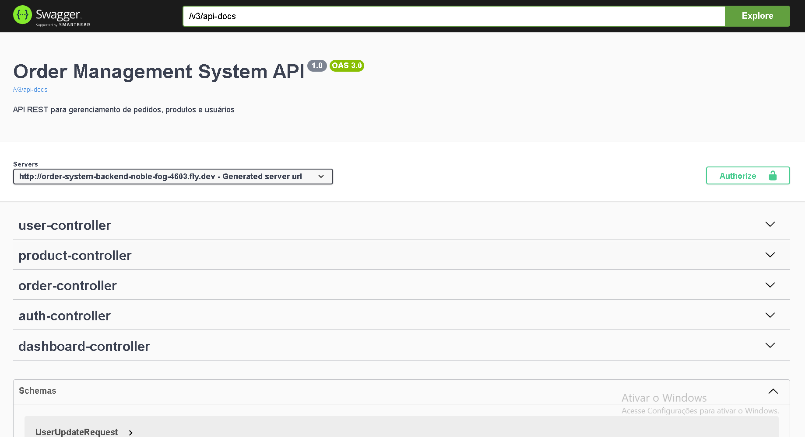

# Order Management System — Backend

[](https://github.com/WiltonReis/order-system-backend/actions/workflows/backend.yml)


API REST multi-tenant para gerenciamento de pedidos, produtos e usuários em modelo SaaS. Desenvolvida com Java 21, Spring Boot 3 e PostgreSQL; autenticação stateless via JWT em cookie `httpOnly` com refresh token; stack de observabilidade completa com Prometheus e Grafana provisionados via Docker Compose.

---

## Sumário

- [Sobre o projeto](#sobre-o-projeto)
- [Infraestrutura](#infraestrutura)
- [Funcionalidades](#funcionalidades)
- [Arquitetura](#arquitetura)
- [Tecnologias](#tecnologias)
- [Multi-tenancy](#multi-tenancy)
- [Segurança](#segurança)
- [Observabilidade](#observabilidade)
- [Como rodar localmente](#como-rodar-localmente)
- [Variáveis de ambiente](#variáveis-de-ambiente)
- [Testes](#testes)
- [Endpoints da API](#endpoints-da-api)
- [Decisões técnicas](#decisões-técnicas)
- [Frontend](#frontend)
- [Licença](#licença)

---

## Sobre o projeto

O **OMS (Order Management System)** é um SaaS B2B de portfólio que simula uma plataforma real de gestão de pedidos com cadastro auto-serviço de empresas (tenants). Cada empresa opera isolada: usuários, produtos e pedidos são completamente segregados por tenant, garantidos por filtros de aplicação e testados por integração real com PostgreSQL.

O objetivo é demonstrar em portfólio a construção de um backend profissional: autenticação segura, multi-tenancy, migrações versionadas, observabilidade de produção com Prometheus/Grafana, geração de PDF e CI/CD.

**Frontend:** [github.com/WiltonReis/order-system-frontend](https://github.com/WiltonReis/order-system-frontend)

| | Link |
|---|---|
| Frontend (produção) | [tanstack-start-app.wiltonfilho0825.workers.dev](https://tanstack-start-app.wiltonfilho0825.workers.dev) |
| Swagger UI (produção) | [order-system-backend-noble-fog-4603.fly.dev/swagger-ui/index.html](https://order-system-backend-noble-fog-4603.fly.dev/swagger-ui/index.html) |

> **Disponibilidade online:** a aplicação pode não estar rodando em produção — manter uma instância no Fly.io tem custo contínuo que não é viável para um projeto de portfólio. Para avaliar o projeto, rode localmente com Docker Compose (instruções abaixo) ou acesse o código-fonte.

---

## Infraestrutura

| Componente | Tecnologia | Detalhes |
|---|---|---|
| Backend | [Fly.io](https://fly.io) | Docker, região São Paulo (`gru`), 512 MB RAM |
| Banco de dados | [Supabase](https://supabase.com) | PostgreSQL 16 gerenciado |
| Armazenamento de imagens | [Cloudflare R2](https://cloudflare.com/r2) | Upload de fotos de produtos |
| Frontend | [Cloudflare Workers](https://workers.cloudflare.com) | TanStack Start (SSR/edge) |

---

## Funcionalidades

- **Registro de tenant** — Empresa (CNPJ/CPF) se cadastra e cria o primeiro usuário ADMIN automaticamente
- **Autenticação** — Login com JWT em cookie `httpOnly`; refresh token de 30 dias; logout limpa ambos os cookies
- **Multi-tenant** — Isolamento completo de dados por empresa via Hibernate `@Filter`
- **Pedidos** — Criação atômica (itens + desconto em uma transação), transições de status, soft-delete com "desfazer" por 1 min
- **Histórico de status** — Toda transição de status é registrada com autor e timestamp
- **Exportação PDF** — `GET /orders/{id}/pdf` gera PDF completo com itens, desconto, totais e dados de auditoria
- **Produtos** — CRUD com upload de imagem para R2
- **Usuários** — Gestão de membros da empresa (ADMIN only); e-mail e nome podem ser reutilizados após soft-delete
- **Dashboard** — Métricas agregadas por tenant (pedidos por status, receita, filtros por período)
- **Rate limiting** — Bucket4j em `/auth/login`, `/auth/register` e `/auth/refresh`
- **Paginação e filtros** — Todos os endpoints de listagem suportam página, tamanho e filtros
- **Observabilidade** — Métricas de JVM, HTTP e banco exportadas via Actuator; coletadas pelo Prometheus e visualizadas no Grafana

---

## Arquitetura

```
┌─────────────────────────────────────────────┐
│           Client (Frontend / HTTP)          │
└──────────────────┬──────────────────────────┘
                   │ HTTPS + Cookie httpOnly
┌──────────────────▼──────────────────────────┐
│              Spring Boot API                │
│                                             │
│  RateLimitFilter → JwtAuthenticationFilter  │
│         → MdcFilter (requestId/MDC)         │
│                   │                         │
│   Controllers  (camada HTTP, DTOs apenas)   │
│       Auth / Order / Product / User         │
│                   │                         │
│   Services  (regras de negócio)             │
│   OrderService / ProductService / ...       │
│                   │                         │
│   Repositories  (Spring Data JPA)           │
│   JPQL com JOIN FETCH — sem N+1             │
│       + Hibernate @Filter (tenancy)         │
│                   │                         │
└───────────────────┼─────────────────────────┘
                    │ JDBC / Flyway migrations
┌───────────────────▼─────────────────────────┐
│        PostgreSQL 16 (Supabase / local)     │
└─────────────────────────────────────────────┘
         │ /actuator/prometheus scrape (15s)
┌────────▼────────────────────────────────────┐
│  Prometheus → Grafana (JVM · HTTP · HikariCP│
│              · CPU · GC · p50/p95/p99)      │
└─────────────────────────────────────────────┘
```

**Pacotes:**

```
src/main/java/com/ordersystem/
├── config/         # SecurityConfig, @ConfigurationProperties (JWT, Cookie, CORS)
├── controller/     # Camada HTTP — thin, sem lógica de negócio
├── dto/
│   ├── request/    # Objetos de entrada com Bean Validation
│   └── response/   # Objetos de saída (nunca expõe entidade diretamente)
├── entity/         # Entidades JPA com @SQLRestriction (soft-delete) e @Filter (tenant)
├── enums/          # OrderStatus, Role
├── exception/      # RFC 7807 ProblemDetail — GlobalExceptionHandler
├── infra/          # MdcFilter, RateLimitFilter
├── repository/     # Spring Data JPA + queries nativas para soft-delete
├── security/       # JwtTokenProvider, JwtAuthenticationFilter, TenantContext
├── service/        # Lógica de negócio + OrderPdfService
└── validation/     # @CpfCnpj (caelum-stella), OrderValidator, UserValidator, AuthValidator, ProductValidator
```

---

## Tecnologias

| Tecnologia | Versão | Uso |
|---|---|---|
| Java | 21 | Linguagem |
| Spring Boot | 3.2.5 | Framework principal |
| Spring Security | 6.x | Autenticação e autorização via `@PreAuthorize` e filtros |
| Spring Data JPA + Hibernate | 6.x | ORM + multi-tenancy com `@Filter` e `@SQLRestriction` |
| PostgreSQL | 16 | Banco de dados |
| Flyway | 10.x | Migrações versionadas (V1–V5) |
| JJWT | 0.12.3 | Geração e validação de JWT |
| Bucket4j | 8.10.1 | Rate limiting em memória (Caffeine) |
| OpenPDF | 2.0.3 | Geração de PDF de pedidos |
| caelum-stella | 2.1.7 | Validação de CPF/CNPJ (algoritmo oficial de dígito verificador) |
| springdoc-openapi | 2.5.0 | Swagger UI automático com `@Tag`, `@Operation`, `@ApiResponses` |
| Spring Actuator | 3.x | Health check + endpoint `/actuator/prometheus` |
| Micrometer (Prometheus Registry) | 1.12.x | Exportação de métricas JVM, HTTP e HikariCP |
| Micrometer Tracing + OTel Bridge | 1.2.x | Tracing distribuído; popula `traceId`/`spanId` no MDC |
| OpenTelemetry OTLP Exporter | 1.36.0 | Envia traces via HTTP para Tempo (DEV) / Grafana Cloud (PROD) |
| Prometheus | 2.52 | Coleta e retenção de métricas (15 dias); exemplar-storage habilitado |
| Grafana Tempo | 2.4 | Armazenamento e consulta de traces; link exemplar → trace |
| Grafana | 11.0 | Dashboards provisionados automaticamente via YAML |
| Testcontainers | 1.21.4 | Testes de integração com PostgreSQL real |
| Logstash Logback Encoder | 7.4 | Logs JSON estruturados em produção |
| Lombok | latest | Redução de boilerplate |
| AWS SDK v2 (S3) | 2.26.12 | Upload de imagens para Cloudflare R2 |

---

## Multi-tenancy

Modelo **shared database / shared schema** com coluna discriminadora `customer_saas_id`.

**Funcionamento:**
1. Registro cria uma `CustomerSaas` (empresa) + primeiro usuário `ADMIN`
2. JWT gerado contém o `tenantId` como claim
3. `JwtAuthenticationFilter` valida o claim e seta `TenantContext` (ThreadLocal)
4. Hibernate `@Filter("tenantFilter")` aplica `WHERE customer_saas_id = :tenantId` em todas as queries
5. `@SQLRestriction("deleted_at IS NULL")` exclui registros soft-deleted automaticamente

**Garantia de isolamento:** teste de integração real com Testcontainers cria dois tenants e verifica que nenhum acessa dados do outro — inclusive registros soft-deleted.



---

## Segurança

| Mecanismo | Detalhe |
|---|---|
| JWT access token | 10 minutos de validade, claim `tenantId` validado a cada request |
| Refresh token | 30 dias, cookie `oms.refresh` httpOnly — renova o par access+refresh |
| Cookie `Secure` | Obrigatório em produção (`COOKIE_SECURE=true`); startup falha se false em prod |
| `@PreAuthorize` | Autorização declarativa por role em todos os endpoints protegidos |
| Rate limiting | Bucket4j: 10 req/min em `/auth/login` e `/auth/register`; 5 req/min em `/auth/refresh` |
| Validação de CPF/CNPJ | `@CpfCnpj` com algoritmo oficial caelum-stella — rejeita valores com dígito verificador inválido |
| RFC 7807 ProblemDetail | Todos os erros retornam `application/problem+json` com `requestId` rastreável e mapa `errors` por campo |
| CORS | Origens permitidas configuradas por variável de ambiente |

---

## Observabilidade

Stack completa provisionada automaticamente via Docker Compose — nenhuma configuração manual necessária. Inclui tracing distribuído ponta-a-ponta com link bidirecional **trace ⇄ log ⇄ metric** via exemplars no Grafana.

| Serviço | Porta local | Descrição |
|---|---|---|
| Spring Actuator | `8080/actuator/prometheus` | Expõe métricas no formato Prometheus |
| Prometheus | `9090` | Coleta métricas a cada 15s; retenção de 15 dias; exemplar-storage habilitado |
| Grafana | `3001` | Dashboard provisionado automaticamente via YAML; link trace → metric via exemplars |
| Tempo | `3200` | Armazena traces OTLP; recebe spans do backend via HTTP em `4318` |

**Dashboard Grafana — painéis:**

| Grupo | Métricas |
|---|---|
| JVM | Heap/Non-Heap usados, GC pauses cumulativo |
| HTTP | Taxa de requisições/s, latência p50/p95/p99, taxa de erros 5xx |
| HikariCP | Conexões ativas, pendentes e tempo de aquisição |
| Sistema | CPU do processo, memória do processo, uptime |

O datasource e o dashboard são configurados via arquivos em `monitoring/grafana/provisioning/` — o Grafana sobe já conectado ao Prometheus e com o dashboard carregado.

Histogramas de latência com percentis p50/p95/p99 estão habilitados globalmente em `application.yml`:

```yaml
management:
  metrics:
    distribution:
      percentiles-histogram:
        http.server.requests: true
      percentiles:
        http.server.requests: 0.5,0.95,0.99
```

```
monitoring/
├── prometheus/
│   └── prometheus.yml            # scrape config — job: spring-boot; exemplar-storage
├── tempo/
│   └── tempo.yaml                # receiver OTLP/HTTP :4318; storage local
└── grafana/
    ├── provisioning/
    │   ├── datasources/          # prometheus.yml + tempo.yml — datasources automáticos
    │   └── dashboards/           # dashboards.yml — pasta Spring Boot
    └── dashboards/
        └── spring-boot.json      # dashboard completo (~1800 linhas)
```

---

## Como rodar localmente

### Opção 1 — Docker Compose (recomendado)

Sobe Postgres + pgAdmin + backend + Prometheus + Grafana com um único comando.

```bash
# Clone o repositório
git clone https://github.com/WiltonReis/order-system-backend.git
cd order-system-backend

# Copie e ajuste as variáveis de ambiente
cp .env.example .env

# Suba todos os serviços
make up
# ou: docker compose up -d
```

**Serviços disponíveis:**

| Serviço | URL |
|---|---|
| Backend API | `http://localhost:8080` |
| Swagger UI | `http://localhost:8080/swagger-ui/index.html` |
| Health check | `http://localhost:8080/actuator/health` |
| pgAdmin | `http://localhost:5050` |
| Prometheus | `http://localhost:9090` |
| Grafana | `http://localhost:3001` (login: `admin` / senha do `.env`) |
| Tempo | `http://localhost:3200` (API HTTP; receiver OTLP em `4318`) |

**Comandos `make` disponíveis:**

| Comando | Ação |
|---|---|
| `make up` | Sobe todos os serviços em background |
| `make down` | Para e remove os containers |
| `make logs` | Acompanha logs de todos os serviços |
| `make dev` | Sobe apenas Postgres + pgAdmin (para rodar o backend local com `mvn`) |

> Docker deve estar em execução. O Postgres sobe com healthcheck; o backend aguarda antes de iniciar. O Prometheus aguarda o backend estar saudável antes de começar a coletar.

---

### Opção 2 — Execução direta (Java + Postgres local)

**Pré-requisitos:** Java 21+, Maven 3.9+, PostgreSQL 16

```bash
# 1. Sobe apenas a infra necessária
make dev
# ou: docker compose up -d postgres pgadmin

# 2. Configure as variáveis de ambiente
export DB_USERNAME=postgres
export DB_PASSWORD=postgres
export JWT_SECRET=$(openssl rand -base64 32)
export COOKIE_SECURE=false
export APP_CORS_ALLOWED_ORIGINS=http://localhost:3000

# 3. Execute
mvn spring-boot:run -Dspring-boot.run.profiles=dev
```

O Flyway cria o schema automaticamente na primeira execução.

---

## Variáveis de ambiente

| Variável | Descrição | Obrigatória em prod |
|---|---|---|
| `DB_USERNAME` | Usuário do PostgreSQL | Sim |
| `DB_PASSWORD` | Senha do PostgreSQL | Sim |
| `JWT_SECRET` | Chave JWT em Base64 (mín. 32 bytes) | Sim |
| `JWT_EXPIRATION_MS` | Validade do access token em ms (padrão: `600000`) | Não |
| `REFRESH_EXPIRATION_MS` | Validade do refresh token em ms (padrão: `2592000000`) | Não |
| `COOKIE_SECURE` | `true` para HTTPS (obrigatório em prod) | Sim |
| `APP_CORS_ALLOWED_ORIGINS` | Origens permitidas (ex.: `https://app.exemplo.com`) | Sim |
| `PGADMIN_EMAIL` | E-mail de login do pgAdmin | Não (local) |
| `PGADMIN_PASSWORD` | Senha do pgAdmin | Não (local) |
| `GF_ADMIN_USER` | Usuário admin do Grafana (padrão: `admin`) | Não (local) |
| `GF_ADMIN_PASSWORD` | Senha admin do Grafana | Não (local) |
| `R2_ENDPOINT` | URL do endpoint Cloudflare R2 | Se usar upload de imagem |
| `R2_ACCESS_KEY` | Access key do R2 | Se usar upload de imagem |
| `R2_SECRET_KEY` | Secret key do R2 | Se usar upload de imagem |
| `R2_BUCKET` | Nome do bucket R2 | Se usar upload de imagem |

Gerar `JWT_SECRET` seguro:
```bash
openssl rand -base64 32
```

---

## Testes

```bash
mvn verify
```

Os testes de integração usam **Testcontainers** — Docker deve estar em execução. Um container PostgreSQL 16 é iniciado automaticamente, o Flyway aplica as migrations e os testes rodam contra o banco real.

**Cobertura atual:**

| Teste | O que valida |
|---|---|
| `TenantIsolationIntegrationTest` | Tenant A não acessa pedidos, produtos e usuários de Tenant B — nem soft-deleted |
| `TenantIsolationIntegrationTest` | Restauração de pedido não afeta outro tenant |
| `UserSoftDeleteIntegrationTest` | E-mail e nome de usuário podem ser reutilizados após soft-delete no mesmo tenant |
| `AuthServiceTest` | Fluxo de login, geração de token e validação de credenciais |
| `OrderServiceTest` | Criação atômica, transições de status, desconto e soft-delete com restore |
| `ProductServiceTest` | CRUD de produto com isolamento de tenant |
| `UserServiceTest` | Gestão de membros com validação de unicidade e permissões |


---

## Endpoints da API

Swagger UI disponível em `/swagger-ui/index.html` em qualquer instância rodando. [Acesse em produção →](https://order-system-backend-noble-fog-4603.fly.dev/swagger-ui/index.html)

> Todos os endpoints (exceto `/auth/**` e `/actuator/health`) exigem autenticação via cookie `oms.token` ou header `Authorization: Bearer <token>`.

### Autenticação — público

| Método | Endpoint | Descrição |
|---|---|---|
| `POST` | `/auth/register` | Registra nova empresa e primeiro usuário ADMIN |
| `POST` | `/auth/login` | Autentica; retorna access token + cookie `oms.token` |
| `POST` | `/auth/refresh` | Renova o par access+refresh usando o cookie `oms.refresh` |
| `POST` | `/auth/logout` | Expira ambos os cookies |

**POST /auth/register — Request:**
```json
{
  "companyName": "Minha Empresa Ltda",
  "cpfCnpj": "11222333000181",
  "name": "João Silva",
  "email": "joao@empresa.com",
  "password": "Senha1234"
}
```

**POST /auth/login — Request:**
```json
{
  "email": "joao@empresa.com",
  "password": "Senha1234"
}
```

---

### Usuários — `ADMIN`

| Método | Endpoint | Descrição |
|---|---|---|
| `POST` | `/users` | Cria usuário na empresa |
| `GET` | `/users?page=0&size=20` | Lista usuários paginado |
| `GET` | `/users/{id}` | Detalhe de um usuário |
| `PUT` | `/users/{id}` | Atualiza dados |
| `PATCH` | `/users/{id}/role` | Atualiza apenas a role |
| `DELETE` | `/users/{id}` | Remove usuário (soft-delete) |

---

### Produtos

| Método | Endpoint | Acesso | Descrição |
|---|---|---|---|
| `POST` | `/products` | ADMIN | Cria produto |
| `GET` | `/products?page=0&size=20` | Autenticado | Lista paginado |
| `GET` | `/products/all` | Autenticado | Lista todos (sem paginação) |
| `PUT` | `/products/{id}` | ADMIN | Atualiza produto completo |
| `PATCH` | `/products/{id}` | ADMIN | Atualiza preço |
| `DELETE` | `/products/{id}` | ADMIN | Remove produto (soft-delete) |
| `POST` | `/products/{id}/image` | ADMIN | Upload de imagem para R2 |

---

### Pedidos

| Método | Endpoint | Acesso | Descrição |
|---|---|---|---|
| `POST` | `/orders` | Autenticado | Cria pedido vazio |
| `POST` | `/orders/full` | Autenticado | Cria pedido completo (itens + desconto, atômico) |
| `GET` | `/orders?page=0&size=20` | Autenticado | Lista pedidos paginado |
| `GET` | `/orders/details` | Autenticado | Lista com itens e filtros (`statuses`, `userId`, `customerName`, `orderCode`, `startDate`, `endDate`, `sort`) |
| `GET` | `/orders/active` | Autenticado | Pedidos em aberto |
| `GET` | `/orders/history` | Autenticado | Pedidos finalizados e cancelados |
| `GET` | `/orders/{id}` | Autenticado | Detalhe completo do pedido |
| `GET` | `/orders/{id}/pdf` | Autenticado | Exporta PDF do pedido |
| `PUT` | `/orders/{id}` | ADMIN | Aplica desconto |
| `PUT` | `/orders/{id}/complete` | Autenticado | Finaliza pedido |
| `PUT` | `/orders/{id}/cancel` | Autenticado | Cancela pedido |
| `DELETE` | `/orders/{id}` | ADMIN | Soft-delete do pedido |
| `POST` | `/orders/{id}/restore` | ADMIN | Restaura pedido excluído (janela de 1 min) |
| `GET` | `/orders/{id}/status-history` | Autenticado | Histórico de transições de status |
| `POST` | `/orders/{id}/items` | Autenticado | Adiciona item |
| `PUT` | `/orders/{id}/items/{itemId}` | Autenticado | Atualiza quantidade |
| `DELETE` | `/orders/{id}/items/{itemId}` | Autenticado | Remove item |

**POST /orders/full — Request:**
```json
{
  "customerName": "Maria Silva",
  "items": [
    { "productId": "a1b2c3d4-...", "quantity": 2 }
  ],
  "discount": 5.00
}
```

**GET /orders/{id}/pdf** — Retorna `application/pdf`. Pedidos soft-deleted retornam 404.



---

### Dashboard

| Método | Endpoint | Acesso | Descrição |
|---|---|---|---|
| `GET` | `/dashboard` | Autenticado | Métricas do tenant (totais por status, receita, filtros por período) |

---

### Infraestrutura

| Endpoint | Acesso | Descrição |
|---|---|---|
| `GET /actuator/health` | Público | Health check — usado pelo Docker e Fly.io |
| `GET /actuator/prometheus` | Interno | Métricas no formato Prometheus (coletadas pelo scraper) |
| `GET /swagger-ui.html` | Público | Documentação interativa da API |



---

## Decisões técnicas

| Decisão | Alternativa descartada | Motivo |
|---|---|---|
| Multi-tenant por filtro de aplicação (Hibernate `@Filter`) | PostgreSQL RLS | RLS exige driver customizado ou SET LOCAL por conexão — complexidade desproporcional para portfólio individual |
| Bucket4j (em memória, Caffeine) para rate-limit | Redis | 1 instância Fly.io — Redis adicionaria custo e infra sem ganho real de escala |
| Soft-delete com `@SQLRestriction` + restore endpoint | DELETE físico | Possibilita "desfazer" exclusão, preserva auditoria e analytics; unicidade por campo mantida via partial index no Postgres |
| Histórico de status manual (`OrderStatusHistory`) | Hibernate Envers | Envers gera schema pesado; histórico de status é o único caso de auditoria necessário no domínio |
| JWT curto (10 min) + refresh token (30 dias) | JWT longo (7 dias) | Reduz janela de comprometimento; refresh transparente no frontend |
| Prometheus + Grafana provisionados via YAML | Grafana configurado manualmente | Infraestrutura como código — qualquer pessoa clona e roda `make up` com stack de observabilidade completa, sem passos manuais |
| Monolito modular | Microsserviços | Projeto solo — overhead de infra não tem retorno |

---

## Frontend

- **Repositório:** [github.com/WiltonReis/order-system-frontend](https://github.com/WiltonReis/order-system-frontend)
- **Stack:** React 19, TypeScript 5.8, TanStack Router/Query 5, shadcn/ui, Tailwind CSS
- **Deploy:** Cloudflare Workers (TanStack Start SSR/edge) — [tanstack-start-app.wiltonfilho0825.workers.dev](https://tanstack-start-app.wiltonfilho0825.workers.dev)

> O link de produção pode estar indisponível — manter a instância Fly.io tem custo não justificável para portfólio.

---

## Licença

Este projeto está licenciado sob a [MIT License](LICENSE).
